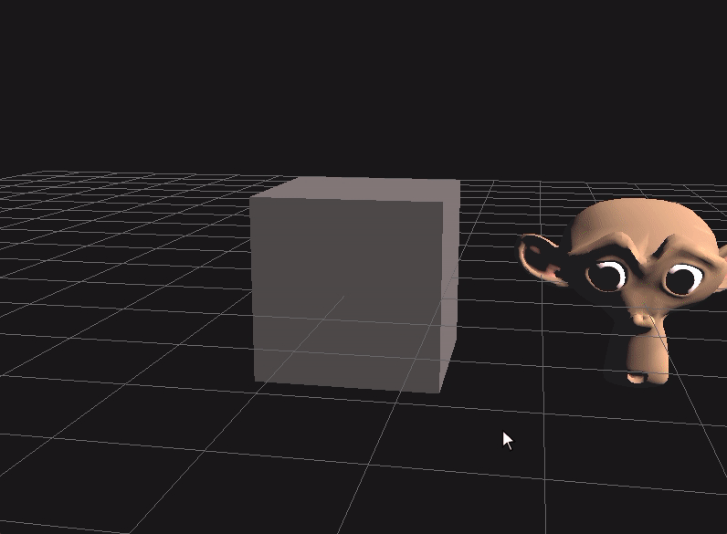

# Description

3D viewer in openGL from scratch as a learning project

# Build

It uses vcpkg to install the dependencies.  
Dependencies are defined in [vcpkg.json](vcpkg.json)  
[How to install vcpkg and use with cmake](https://learn.microsoft.com/en-us/vcpkg/get_started/get-started?pivots=shell-powershell)

# References

[Opengl reference](https://registry.khronos.org/OpenGL-Refpages/gl4/)  
[LearnOpenGl](https://github.com/JoeyDeVries/LearnOpenGL)  
[Object selection](https://en.wikibooks.org/wiki/OpenGL_Programming/Object_selection)  
